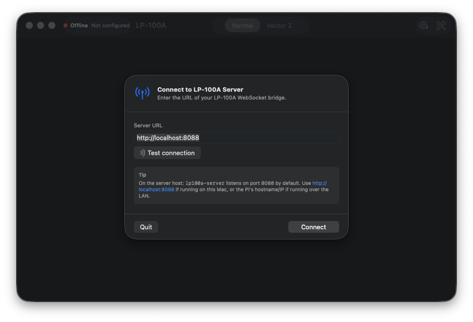
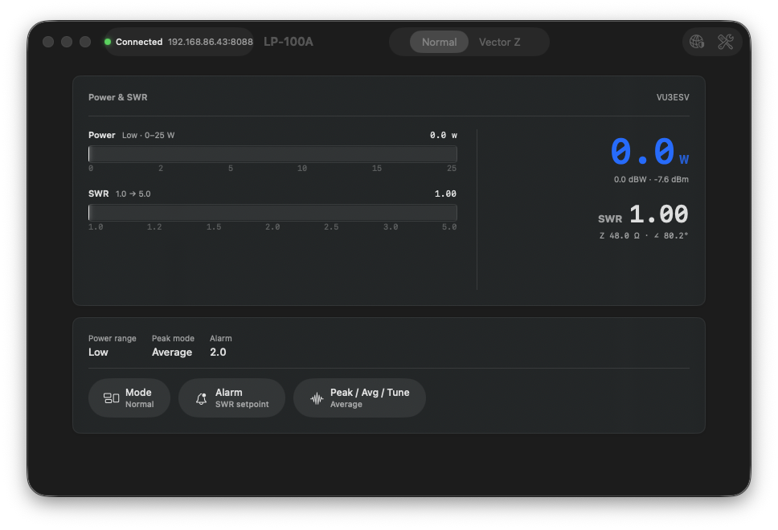
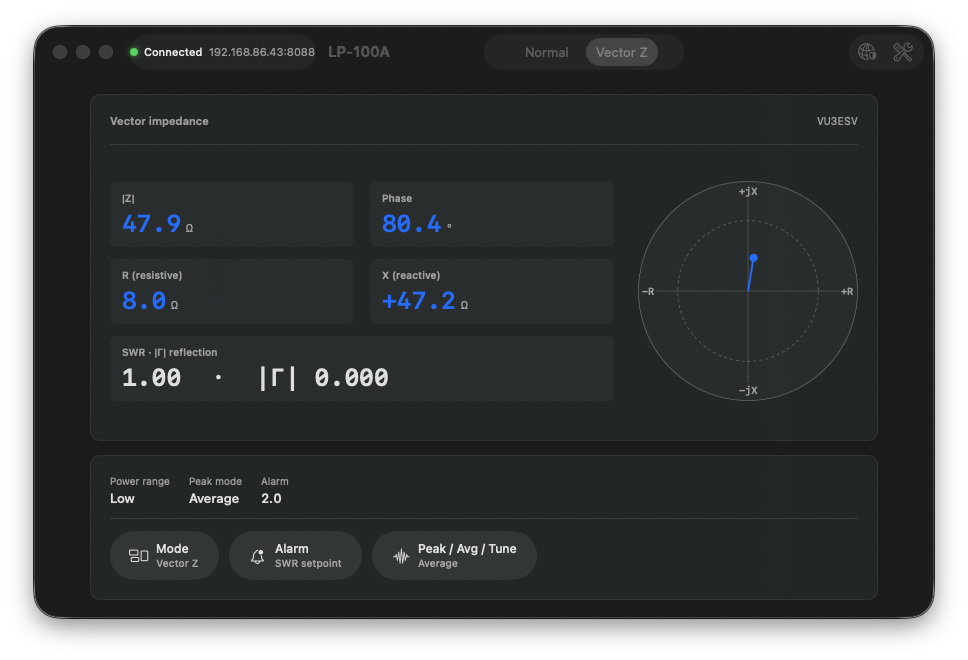
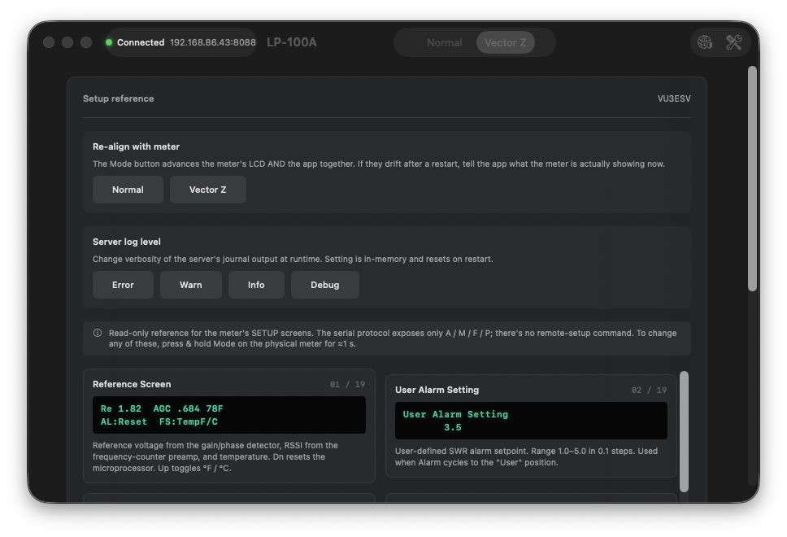
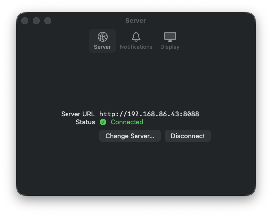

# LP-100A-App — User Manual

**Version:** 0.2.0 · **Platform:** macOS 13 (Ventura) and later

LP-100A-App is a native Mac client for the
[LP-100A WebSocket Server](https://github.com/VU3ESV/LP-100A-Server). The
server owns the serial connection to your Telepost LP-100A RF Power Meter
and exposes telemetry + control over WebSocket; this app is the desktop
front-end that streams those readings into a real Mac window with native
toolbar, menu bar, notifications, and keyboard shortcuts.

---

## 1. Install

1. Download `LP-100A-App-<version>.dmg` from the
   [Releases page](https://github.com/VU3ESV/LP-100A-App/releases).
2. Open the DMG and drag **LP-100A.app** onto **Applications**.
3. The app is ad-hoc-signed (Apple Developer ID notarization is a v0.3
   item), so the first launch needs a one-time Gatekeeper bypass:
   ```sh
   xattr -d com.apple.quarantine /Applications/LP-100A-App.app
   ```
4. Launch from Spotlight, Launchpad, or `/Applications`.

> **Note** If you built the app yourself with `scripts/build-app.sh`, no
> `xattr` step is needed — locally-built apps aren't quarantined.

---

## 2. First launch — connect to your server

The app opens a **Connect to LP-100A Server** sheet automatically the
first time it runs (no `serverURL` configured yet):



1. Enter the URL of your LP-100A WebSocket server.
   - Local server on this Mac: `http://localhost:8088`
   - Pi or other host on the LAN: `http://raspberrypi.local:8088`,
     `http://192.168.1.42:8088`, etc.
2. Optionally hit **Test connection** — it probes `/healthz` on the
   server. A green check means reachable; an orange warning means the
   URL is wrong, the server isn't running, or the LAN can't see it.
3. Click **Connect** (or press **Enter**). The sheet closes and the app
   opens a WebSocket to the server, requesting an immediate snapshot.

If the server is unreachable, the connection badge in the toolbar will
show **Reconnecting** (yellow) and retry with exponential backoff
(0.5 s → 10 s) until either the server appears or you change the URL via
**File → Connect to Server… (⌘K)**.

---

## 3. The main window

Once connected, the main window splits into a toolbar, an instrument
panel, and a status + keypad row:



### 3.1 Toolbar

| Element | What it shows | Click |
|---|---|---|
| **Connection badge** | Green dot + "Connected" + host:port (or yellow "Reconnecting", or red "Offline") | (read-only — change server via the shield button or ⌘K) |
| **View picker** | Segmented control: **Normal** / **Vector Z** | Tap to switch view |
| **Shield icon** (right) | Server connection settings | Re-opens the **Connect to LP-100A Server** sheet so you can change URLs |
| **Wrench icon** (right) | SETUP reference | Toggles the SETUP overlay |

### 3.2 Status row

Below the instrument panel:

- **Power range** — Low (0–25 W), Mid (0–125 W), High (0–750 W). Set on
  the meter's Range button — this app doesn't change it.
- **Peak mode** — Average / Peak Hold / Tune. Cycle with the **Peak /
  Avg / Tune** keypad button.
- **Alarm** — current SWR alarm setpoint (off / 1.5 / 2.0 / 2.5 / 3.0 /
  user). Cycle with the **Alarm** keypad button. Shows in red and
  blinks if the alarm is currently tripped.
- **Not connected** indicator on the right when the WebSocket is down.

### 3.3 Keypad

The three control verbs the LP-100A's serial protocol accepts:

| Button | Sends | Keyboard |
|---|---|---|
| **Mode** | `mode_step` (advances the meter's Peak/Avg/Tune cycle and the app's view in lockstep) | ⌘M |
| **Alarm** | `alarm_step` (advances the SWR alarm setpoint cycle) | ⌘A |
| **Peak / Avg / Tune** | `peak_toggle` (the same as the meter's `F` button) | ⌘P |

If the server was started with `allow_control = false`, the keypad shows
"Read-only" and all three buttons are disabled.

---

## 4. Normal view

The default view. Two horizontal bargraphs on the left and big numeric
readouts on the right.


- **Power bargraph.** Range-aware — the scale label shows the current
  range and tick marks adjust per range. Fill is teal; a sticky white
  marker tracks the recent peak (decays after 1.5 s).
- **SWR bargraph.** Always 1.0 → 5.0 scale. Fill changes color as
  signal severity rises:
  - Teal: SWR < 1.5
  - Yellow: 1.5 ≤ SWR < 2.0
  - Red: SWR ≥ 2.0
- **Power readout.** The big number top-right with a unit suffix that
  matches the LP-100A LCD convention:
  - `w` lowercase — Average mode
  - `W` uppercase — Peak Hold
  - `T` — Tune
- **dBW / dBm** values shown below the power readout.
- **SWR readout.** Bottom-right block with `Z = … Ω · ∠ = …°` underneath.

---

## 5. Vector Z view

Press **⌘2** or click **Vector Z** in the toolbar's view picker.



The same telemetry rendered as impedance:

- **|Z|** — magnitude of the impedance, in ohms.
- **Phase** — angle of the impedance vector, in degrees.
- **R (resistive)** — `R = |Z| · cos(phase)`, derived from the snapshot.
- **X (reactive)** — `X = |Z| · sin(phase)`, with sign preserved.
- **SWR · |Γ|** — the SWR plus the magnitude of the reflection
  coefficient, `|Γ| = (SWR − 1) / (SWR + 1)`.

The polar compass on the right plots the impedance vector. The needle
length is `min(1, |Z|/100)` of the inner ring; the dot at the tip marks
the vector endpoint. Axis labels: **+R** right, **−R** left, **+jX**
up, **−jX** down.

---

## 6. SETUP overlay

Click the **wrench icon** in the toolbar (or press **⌘.**) to open the
SETUP overlay. It replaces the active view and gives you three things:



### 6.1 Re-align with meter

The LP-100A's serial protocol gives no readback of the meter's current
peak/avg/tune state. The app counts the `M` presses it has sent to keep
its own pointer aligned, but if the meter is power-cycled or you press
the physical Mode button on the front panel, the app's view cycle and
the meter's LCD can drift apart.

Use the **Normal / Vector Z** chips here to tell the app what the meter
is actually showing now — that resets the alignment.

### 6.2 Server log level

Read and write `/api/log-level` on the server. Choices:
**Error** (default, quiet) / **Warn** / **Info** / **Debug** (full
per-frame trace). The setting is in-memory on the server and resets to
its CLI default (`-v` flag) on restart.

### 6.3 SETUP reference cards

A read-only mirror of the LP-100A's 19 SETUP screens, ported from the
LP-100A Quick Start Guide v4.1. The serial protocol exposes only
`A` / `M` / `F` / `P` and has no remote-setup command — to change any
of these, press & hold **Mode** on the physical meter for ≈1 s, then
use **Mode (next)** / **Alarm-Dn (lower)** / **Peak-Up (raise)**. The
cards are here as quick reference so you don't need to find the PDF.

---

## 7. Preferences (⌘,)



Three tabs:

- **Server** — current URL, connection status, **Change Server…** (opens
  the Connect sheet), **Disconnect** / **Reconnect**.
- **Notifications** — toggle for native macOS alerts on SWR alarm
  trips.
- **Display** — toggle for the menu-bar live readout (restart required).

The Server URL is read-only here; to change it, click **Change Server…**
which opens the same Connect sheet from first launch.

---

## 8. Menu bar (status item)

When the menu-bar item is enabled (Preferences → Display, on by default),
a compact live readout appears in the system status bar:

```
● 1457W · 1.02
```

- The leading character reflects connection state: `●` connected,
  `◐` reconnecting, `○` offline.
- Power is shortened to kW when ≥ 1000 W.

Clicking it opens a small popover with the full readout block (PWR,
SWR, Range, Mode, Alarm) plus three actions:

- **Show LP-100A Window** (⌘O) — bring the main window to the front.
- **Connect to Server…** — open the Connect sheet from anywhere.
- **Quit**.

The menu-bar item is the reason this app exists as a real Mac client
rather than a browser tab — you can keep it in your peripheral vision
while you're in your logger or DAW.

---

## 9. Keyboard shortcuts

| Action | Shortcut |
|---|---|
| Connect to Server… | **⌘K** |
| Disconnect / Reconnect | **⇧⌘D** |
| Preferences | **⌘,** |
| Switch to Normal view | **⌘1** |
| Switch to Vector Z view | **⌘2** |
| Toggle SETUP overlay | **⌘.** |
| Resync (request snapshot) | **⌘R** |
| Cycle Mode (sends `mode_step`) | **⌘M** |
| Step Alarm Setpoint (sends `alarm_step`) | **⌘A** |
| Toggle Peak/Avg/Tune (sends `peak_toggle`) | **⌘P** |
| Show LP-100A Window (from menu bar) | **⌘O** |
| Quit | **⌘Q** |

---

## 10. Behavior notes & FAQs

### The connection badge is yellow

Yellow = "Reconnecting". Two common causes:

- The server isn't reachable yet (wrong URL, wrong port, server not
  running, LAN problem). Open the Connect sheet (⌘K) and re-test.
- The connection was alive, but no inbound frames arrived for >4 s
  (heartbeat watchdog tripped). The app will auto-reconnect with
  exponential backoff. If it stays yellow, check the server logs.

### The bargraphs read 0 even when the meter is showing power

If the meter's serial Power and dBm fields read noise floor during TX,
that's a known meter-side quirk in some firmware versions — Z, phase,
and SWR remain correct, so the **Vector Z** view stays accurate. See
the server's CLAUDE.md "Removed views" section for details.

### The Mode button advanced the meter but the app didn't switch view

The app and meter should advance together. If they drift (after a meter
restart, or if someone presses the **Mode** button on the front of the
meter), use the SETUP overlay's **Re-align with meter** picker to tell
the app what the meter is actually showing.

### Sleep and wake

When the Mac sleeps, the WebSocket connection eventually drops. On
wake, the app receives `NSWorkspace.didWakeNotification` and issues a
fresh reconnect — the connection badge briefly goes yellow then green
again. No interaction needed.

### Read-only server (`allow_control = false`)

If your server config disables control, the keypad disables and shows
"Read-only" in the status row. You can still view live telemetry; the
meter is controlled either at the front panel or by another client
that's allowed to send commands.

### What about a real meter?

If your server is running but no LP-100A is plugged in, the server
keeps trying to open the serial port and emits heartbeat-only frames.
The connection badge stays green; the readouts show `—`. Plug the
meter in and the app will start showing telemetry within one poll
cycle.

---

## 11. Troubleshooting

| Symptom | Likely cause | Fix |
|---|---|---|
| App won't open ("damaged or incomplete") | Quarantine attribute from a downloaded DMG | `xattr -d com.apple.quarantine /Applications/LP-100A-App.app` |
| Connection sheet won't accept URL | Missing scheme | Use `http://host:port`, not `host:port` |
| **Test connection** fails with "Could not connect to the server" | Wrong host, server not running, or firewall | Try `curl http://<host>:8088/healthz` from a terminal |
| Connection drops every minute | Mac sleeping or networking flapping | Check the connection badge — it should auto-reconnect; otherwise check the server logs |
| Power-mode suffix shows `W` when meter shows `w` | Mode-cycle drift | Open SETUP overlay, click the actual current mode in the **Re-align with meter** row |
| Menu-bar item not visible | Disabled in Preferences | Preferences → Display → toggle on; relaunch app |

---

## 12. Capturing additional screenshots

A small helper script is included for users contributing screenshots:

```sh
./scripts/grab-screenshot.sh <name> [delay-seconds]
```

Example workflow:

```sh
# Get the app to the desired state first.
./scripts/grab-screenshot.sh my-state 0
# Or use a delay to switch focus and pose the UI:
./scripts/grab-screenshot.sh my-state 5
```

Output lands in `docs/screenshots/<name>.png`. The script uses
`CGWindowListCopyWindowInfo` to find the LP-100A window (no
Accessibility permission required). Modal sheets attached to the main
window are captured automatically; transient popovers (like the
menu-bar dropdown) can be captured with a non-zero `delay` so you have
time to open them before the screenshot fires.

---

## 13. Privacy and security

- **No telemetry collection.** The app makes outbound network
  connections only to the server URL you configured.
- **No authentication.** Per the server's design, deploy the server on
  a trusted LAN; the app inherits that trust model.
- **No background data**. UserDefaults stores only the server URL, the
  notification toggle, and the menu-bar toggle.

---

## 14. Where to file issues

- App bugs / requests → https://github.com/VU3ESV/LP-100A-App/issues
- Server / wire-protocol questions →
  https://github.com/VU3ESV/LP-100A-Server/issues

For protocol details see the server's
[PROPOSAL.md §4](https://github.com/VU3ESV/LP-100A-Server/blob/main/PROPOSAL.md).
For app architecture see [ARCHITECTURE.md](../ARCHITECTURE.md).
